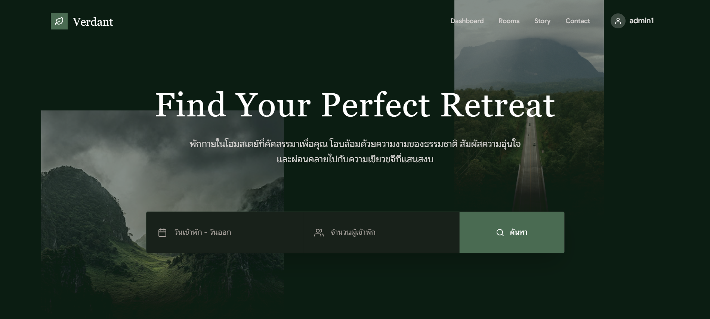
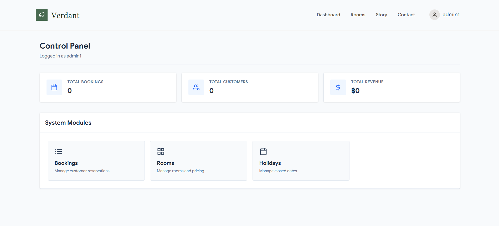
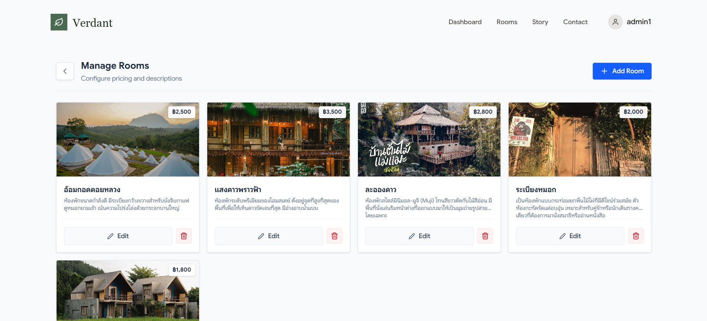
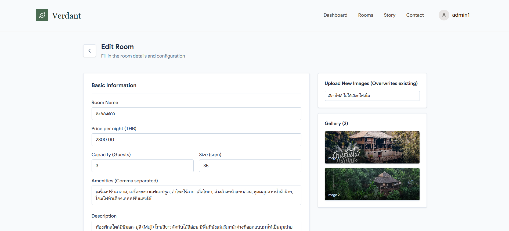

# 🌿 Homestay Reservation System
### ระบบจัดการและจองที่พักระดับพรีเมียม (Full-stack Application)

ระบบเว็บแอปพลิเคชันที่ออกแบบมาเพื่อเปลี่ยนประสบการณ์การจองที่พักโฮมสเตย์ให้เรียบง่าย สวยงาม และทรงพลัง ด้วยดีไซน์ที่ทันสมัยในธีม **Emerald & Nature** พร้อมระบบหลังบ้านที่จัดการข้อมูลได้อย่างเบ็ดเสร็จ

---

## ระบบการใช้งาน

สัมผัสความลื่นไหลของระบบที่ถูกออกแบบมาเพื่อผู้ใช้งานโดยเฉพาะ ตั้งแต่การค้นหาไปจนถึงการจอง

### 1. หน้าแรกและการค้นหา 
ระบบค้นหาอัจฉริยะที่รองรับการเลือกวันที่ (Date Range) และจำนวนผู้เข้าพัก พร้อมการแสดงผลที่ตอบสนองทุกอุปกรณ์

> *คลิปการใช้งานหน้าแรกและระบบค้นหา*
<video src="https://github.com/user-attachments/assets/fc5cc73c-9a73-47ab-9fb5-b565384ae7cb" width="100%" controls></video>

---

### 2. รายการที่พักและรายละเอียด (Room Exploration)
แสดงรายการที่พักในรูปแบบที่สวยงาม พร้อมระบบกรองสถานะห้องว่างแบบ Real-time และหน้ารายละเอียดที่พักที่รองรับ Markdown

| รายการห้องพัก (Room Listing) | รายละเอียดห้องพัก (Room Details) |
| :---: | :---: |
| <video src="https://github.com/user-attachments/assets/25df8125-483d-4bd7-a6c9-6866b00d5505" width="100%" controls></video> | <video src="https://github.com/user-attachments/assets/a93868da-bc5a-4019-b391-f34f5105c6d8" width="100%" controls></video> |

---

### 3. ขั้นตอนการจอง (Booking)
ขั้นตอนการจองที่เข้าใจง่าย ป้องกันการจองซ้ำซ้อน (Overlap Prevention) และระบบจัดการสถานะการชำระเงิน

<video src="https://github.com/user-attachments/assets/2b7a9c2c-ab28-4f5c-b6b5-b6a79828bc0d" width="100%" controls></video>

---

## ระบบจัดการหลังบ้าน (Admin)

แอดมินสามารถควบคุมทุกอย่างได้ผ่าน Dashboard ที่เรียบง่ายแต่ทรงพลัง

### แดชบอร์ดภาพรวม (Admin Dashboard)
ติดตามสถานะการจองและข้อมูลสรุปสำคัญได้ทันที

### การจัดการห้องพัก (Room Management)
ระบบจัดการข้อมูลห้องพักที่ยืดหยุ่น รองรับการอัปโหลดรูปภาพหลายรูป และการแก้ไขข้อมูลแบบ Dynamic
| จัดการรายการห้องพัก | ระบบแก้ไขข้อมูล (Editor) |
| :---: | :---: |
|  |  |

---

## Tech Stack

โปรเจกต์นี้เลือกใช้เทคโนโลยีที่ทันสมัยเพื่อให้ได้ประสิทธิภาพสูงสุด:

*   **Frontend**: React.js + Vite (ลื่นไหลและรวดเร็ว)
*   **Styling**: Tailwind CSS + Framer Motion (ดีไซน์สวยงามและ Animation ที่นุ่มนวล)
*   **Backend**: Node.js + Express.js (จัดการ API ได้อย่างมั่นคง)
*   **Database**: PostgreSQL (จัดการข้อมูลที่มีความสัมพันธ์ได้อย่างแม่นยำ)
*   **Security**: JWT + Bcrypt (ระบบล็อกอินที่ปลอดภัย)

---

## เริ่มต้นใช้งาน

1.  **Backend**: `cd back-end && npm install && npm run dev`
2.  **Frontend**: `cd front-end && npm install && npm run dev`
*(ดูรายละเอียดการตั้งค่าฐานข้อมูลในโฟลเดอร์ config)*

